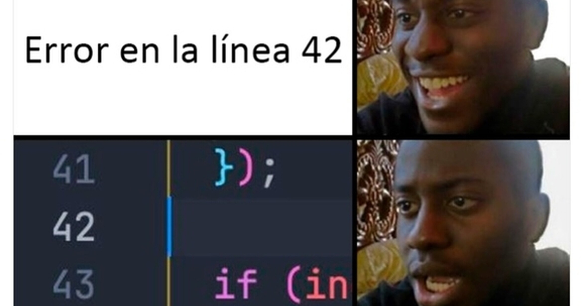

# Hola Mundo :D Markdown

Lorem ipsum dolor sit amet consectetur adipisicing elit. Recusandae, voluptatibus, molestiae omnis, voluptas ullam dolorem accusantium cumque minima quod saepe quis corporis eos nemo sequi dolore reiciendis dignissimos? Quis, provident.

Lorem ipsum dolor sit amet consectetur adipisicing elit. Recusandae, voluptatibus, molestiae omnis, voluptas ullam dolorem accusantium cumque minima quod saepe quis corporis eos nemo sequi dolore reiciendis dignissimos? Quis, provident.

Si quieres que te aprezca en [_Cursivas usa guines bajo_]

Si quieres que te aparezca **negrita la letra usa 2** [**] al inicio y final 

Si quieres que te aparezca ***negrita y cursiva*** puedes usar 3[* * *] o [ _ * *] al inicio y final 

# ENCABEZADO DE NIVEL 1
## ENCABEZADO DE NIVEL 2
### ENCABEZADO DE NIVEL 3
#### ENCABEZADO NIVEL 4
##### ENCABEZADO DE NIVEL 5
###### ENCABEZADO DE NIVEL 6

[Visita mi sitio web de discord ]( https://discord.io/Atraxx_00 )

## MEME DE LA WEB 


## MEME DE CARPETA 

# ESTA ES PARA CREAR LISTAS USANDO -----( 1. y - )

## LISTAS

1. Primavera
1. Verano
1. Otoño
1. Invierno 

## - Primavera
- Lunes
- Martes 
- Miercoles

## - Verano
- Jueves
- Viernes
- Sabados

## - Otoño
- Domingo 1
- Domingo 2
- Domingo 3

# ESTO ES PARA CITAR ALGO USANDO ( > )
> "La tecnologia es una necesidad"
>
>ELLIOT REYES 

# ESTO ES PARA TABLAS USANDO ( | )

|NOMBRE|APELLIDO|PAIS|
|---|---|---|
|Elliot|Reyes|Mexico|

# ESTO ES PARA UN ARCHIVO FUENTE USANDO ( `` )
```` JS
function sumar(a, b) {
  if (typeof a !== "number" || typeof b !== "number") {
    console.error(`Los valores ingresados NO son números.`);
    return false;
  }

  let c = a + b;
  return c;
}
````

# HTML
````HTML
<form>
  <label for="q">Buscar:</label>
  <input type="search" name="q" id="q" required />
  <input type="submit" value="🔍" />
</form>
````


